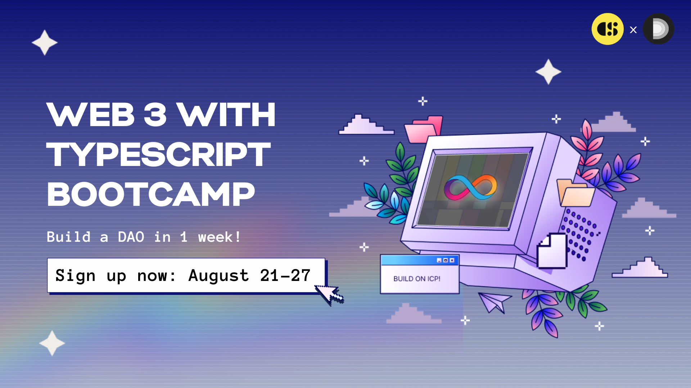

# Web3 with TypeScript Bootcamp
Join the Web3 with TypeScript Bootcamp powered by Code & State and get started in Web3 in one week. 

**No previous experience with Web3 or the Internet Computer is required**. Only prior experience with TypeScript is required.  

This one-week program is a unique opportunity to get your hands dirty and learn about the Internet Computer and DAOs.

 </img>
> The bootcamp was originally held from August 21st to 27th, but all of its resources are now permanently accessible. You are welcome to work on the project, view the recorded workshops, and follow the day-by-day guides at your own pace. If you complete the requirements, you can still earn your graduation certificate. Just fill out the graduation form, which is regularly reviewed for new submissions. **Best of luck.**

## Goal 🎯
Build a DAO. 

> A DAO, or Decentralized Autonomous Organization, represents a novel form of collaboration. Leveraging blockchain technology, we are creating software that enables more efficient and transparent collaborative efforts.

## Important resources 📌
- [Everything You Need To Know About the TypeScript Bootcamp](https://medium.com/code-state/everything-you-need-to-know-about-the-typescript-bootcamp-%EF%B8%8F-fed8e64b9c51)
- [Join the Code & State Discord to receive updates, and be part of our community](https://discord.com/invite/VxC9UXpy4c)

## Pre-Bootcamp Checklist ✅
To make sure you are fully prepared and can make the most out of this experience, I’ve created a checklist for you. This contains actions and items to make sure you are full ready to start this project.

- [Read the Pre-Bootcamp Checklist](./guides/Pre-Bootcamp.MD)

## Workshops 🍿
A workshop is a technical presentation, generally accompanied by live coding. Those workshops have been presented by the mentors of the TypeScript Bootcamp and recorded. 

- [Consult the Recordings of Workshops](https://www.youtube.com/playlist?list=PLeNYxb7vPrkj3SNntZ9ANchomvAPdrU8F)

## Project 🏗️
This is the project that you have to build. Each day you will have to work on specific functionalities for your application. 

- [Read the Complete Project Requirements](./guides/Project.MD)

## Daily guides 📜
For each day, you will find a dedicated companion guide. This guide is meant to help you build the project. Each day will focus on a specific functionality. The suggested schedule and pace in the daily guides are meant to guide your progression. However, don't worry if you're not keeping up with the exact pace.
- [Day 1](./guides/days/Day_1.MD)
- [Day 2](/guides/days/Day_2.MD)
- [Day 3](/guides/days/Day_3.MD)
- [Day 4](/guides/days/Day_4.MD)
- [Day 5](/guides/days/Day_5.MD)
- [Day 6](/guides/days/Day_6.MD)
- [Day 7](/guides/days/Day_7.MD)

## Templates 🎨
This repository includes template projects to help you begin your Internet Computer project using TypeScript and popular frontend frameworks such as:
- [React](./templates/vite-react-azle/README.md)
- [Vue](./templates/vite-vue-azle/README.md)
- [Svelte](./templates/vite-svelte-azle/README.md)
- [NextJS](./templates/next-azle/README.md)

## Educational Resources 📚
This is a collection of key educational resources that you might find useful. For more specialized resources, refer to the daily guides.

| Title | Type |  URL | Description
|-----------------|-----------------|-----------------|-----------------|
| How to setup your environment to start building on the Internet Computer? | Video | [Click Here](https://www.youtube.com/watch?v=DTDP7WYU07w) | A tutorial to help you install `dfx` and setup your environment. 
| What is the Internet Computer? | Video | [Click Here](https://www.youtube.com/watch?v=CaPby7fnROE) | But what is ICP in the end?  
| The Azle Book | Documentation | [Click Here](https://demergent-labs.github.io/azle/) | An in-depth guide to canister development in TypeScript on the Internet Computer.
| Awesome Internet Computer | Repository | [Click Here](https://github.com/dfinity/awesome-internet-computer) | A curated list of awesome projects and resources relating to the Internet Computer Protocol.
| Internet Computer Developer Documentation | Documentation | [Click Here](https://internetcomputer.org/developers) | The official developer documentation for the Internet Computer.

## How to graduate? 🎓
To graduate, you must create and deploy a DAO that meets the following criteria:

- [ ] Users must be able to login using an authentication service, such as **Internet Identity**, and set up a profile.
- [ ] Upon user login, their information should automatically populate.
- [ ] User data should be stored within the canister and remain intact even through upgrades.
- [ ] Your application is deployed on the Internet Computer.
- [ ] Your source code is published on GitHub and public.
- [ ] You’ve used Azle.
- [ ] You’ve completed [the graduation form](https://forms.gle/8kHddDJhAUWdQ6S68)

Successfully meeting these requirements aligns with the tasks set for **Day 1** and **2**  of the project.

> Reviews of the graduation form might take several weeks. **Please stay patient.** 

## Socials ✨
### Code & State
> Making it easier for entrepreneurs to build and earn on the Internet Computer - **Let’s f∞cking build!**

- [Discord](https://discord.gg/VxC9UXpy4c)
- [WhatsApp](https://chat.whatsapp.com/Hw9YFSycNoH9mFdIbbRqBb)
- [YouTube](https://www.youtube.com/@codeandstate/videos)
- [Twitter](https://twitter.com/codeandstate)

### Demergent Labs
> Accelerating the adoption of Web3, the Internet Computer, and sustainable open source.
- [Twitter](https://twitter.com/demergentlabs)
- [GitHub](https://github.com/demergent-labs)

## Assistance 🙋
If you need support or have any question. Make sure to ask your question in the [ask-questions](https://discord.gg/FNSYrvJGnR) section of our Discord.

## License 📝

The [CC BY 4.0](LICENSE.MD) license allows others to distribute, remix, adapt, and build upon your work, even commercially, **as long as they credit you for the original creation**.

---
Let's f♾️cking build!