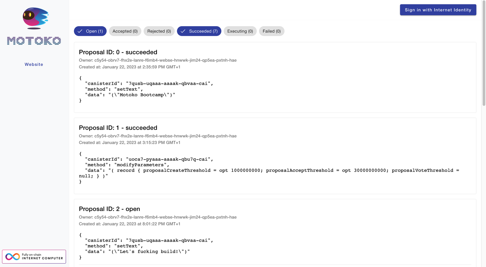

# Project requirements

### ****🤔 Motivation****

This Bootcamp is not a hackathon, and should not be approached as a competitive event. The primary purpose is to be a shared effort to promote the Internet Computer, and train a new generation of developers. 

However, we strongly believe that building a complete application is the best way to help you acquire all the necessary knowledge to build on the Internet Computer.

### ****☑️ Requirements****

The objective is to create a **DAO (Decentralized Autonomous Organization)** that meets the following criteria:

- The project should consist of at least one webpage (frontend) and one backend canister.
- On the webpage, users can log in, create profiles, and register with the organization.
- Registered users can create proposals and participate in voting on them.
- The organization should have control over an external system, such as a website, a token ledger, an NFT collection, or a treasury.
- Approved proposals should be automatically executed and trigger various actions, like changing webpage designs, minting or burning tokens, altering NFT colors, or transferring funds from the treasury to another wallet - feel free to get more creative!
- The code should be easy to understand and concise.
- The code must be secure, safe, and free of any bugs.

### ©️ ****Example****

Here is an example of such a project. This dApp was build by a student during Motoko Bootcamp (January 2023). Feel free to take inspiration from it (but don’t copy it!)

- Live URL: https://7xvuv-ziaaa-aaaak-qbvaq-cai.ic0.app/

-----

This project includes: 
1. Logging in with Internet Identity.
2. Creating proposals and voting on them.
3. Modifying an **[external website](https://7qusb-uqaaa-aaaak-qbvaa-cai.ic0.app/)** linked to the DAO.

However, the project lacks the ability to:

- Set up a profile and register with the organization.

### ℹ️ ****Additional information****
The requirements seem unclear, and you're not sure where to start? As the days go on, we'll explain each requirement in more detail. We'll give you guidance and resources to help you out. Make sure to check the daily guides. [Additionally there is a dedicated workshop that goes over what you need to build]().

### 🎨 Template to get started
There's no specific framework you need to use. Choose the one you're familiar with. Take a look at the available templates to get started.