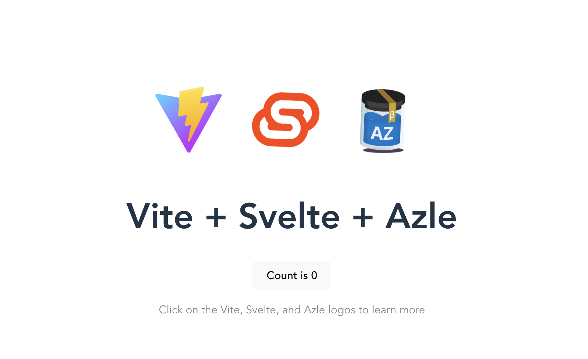

# Day 1

## Introduction 👋

Welcome to the elite **Web3 with TypeScript Bootcamp**, where talented minds like yours gather to learn and master the art of programming on the **Internet Computer**.

Today marks your exciting first day, and while it may be intense, take the chance to bond with your teammates and brace yourself for the adventure ahead. 

Don't worry if you fall behind; allow yourself the time needed to grasp the material. Keep in mind that 7 days is a brief period to learn everything there is to know about **Web 3.0** and the **Internet Computer.** All resources will be available after the week is over, so you can catch-up on anything you've missed.

Above all, the most important aspect of this week is to have fun, build connections and learn.

## Goal(s) of the day 🎯

Today's objectives are to familiarize yourself with the **Internet Computer** and the concept of a **DAO**. We will also ensure you understand what we're going to build in the upcoming days, and most importantly, why we want to built it. 

By the end of the day, here are your goals:

- [ ]  You have a basic understanding of the Internet Computer and how it works.
- [ ]  You have successfully downloaded and setup one of the starter template.  The project is running locally.
- [ ]  You have acquired cycles and can deploy canisters on the Internet Computer.
- [ ]  You have a basic understanding of what is a DAO and how to start your project.
- [ ]  You are excited to be pioneering a new way to organize humans and society 😎

 </img>

 Here is what the template that you should be running looks like. You can also use the React, Vue or even Vanilla JavaScript version of the template. 

## Useful resources 📚
| Title | Type |  URL | Description
|-----------------|-----------------|-----------------|-----------------|
| What is the Internet Computer? | Video | [Click Here](https://www.youtube.com/watch?v=CaPby7fnROE) | Welcome to the world of the Internet Computer, a revolutionary new technology that is changing the way we think about computing. ♾️
| How to acquire cycles?  | Article | [Click Here](https://internetcomputer.org/docs/current/developer-docs/setup/cycles/) | Learn how to acquire and use cycles. Cycles are necessary to deploy your applications on the Internet Computer
| Internet Computer Overview | Article | [Click Here](https://demergent-labs.github.io/azle/internet_computer_overview.html) | The Internet Computer (IC) is a decentralized cloud platform. Actually, it is better thought of as a progressively decentralizing cloud platform. Its full vision is yet to be fulfilled.
| Fundamental concepts | Article | [Click Here](https://github.com/motoko-bootcamp/motoko-starter/blob/main/manuals/chapters/chapter-1/CHAPTER-1.MD#what-is-a-canister) | An article from Motoko Bootcamp that contains fundamental information about what is a canister and how it works. **A must-read!**
| What is a canister? | Article | [Click Here](https://demergent-labs.github.io/azle/canisters_overview.html) | Canisters are Internet Computer applications. They are the encapsulation of your code and state, and are essentially Wasm modules.
| Update calls | Article | [Click Here](https://demergent-labs.github.io/azle/update_methods.html) | Update calls are processed through consensus.
| Query calls | Article | [Click Here](https://demergent-labs.github.io/azle/query_methods.html) | Query calls are processed by one and only one node.
| Inside The Internet Computer - Chain Key Cryptography | Video | [Click Here](https://www.youtube.com/watch?v=vUcDRFC09J0) | Chain Key cryptography is one of the fundamental breakthroughs enabling the Internet Computer to scale to millions of nodes. The most notable innovation of Chain Key cryptography is that the Internet Computer has a single public key, which enables any device to verify the authenticity of artifacts generated by the Internet Computer, even smart watches and mobile phones.
| A beginner’s guide to DAO | Article | [Click Here](https://linda.mirror.xyz/Vh8K4leCGEO06_qSGx-vS5lvgUqhqkCz9ut81WwCP2o) | A beginner’s guide to DAOs by Linda Xie.
| Unlocking the power of DAOs  with canisters | Article | [Click Here](https://github.com/motoko-bootcamp/motoko-starter/blob/main/manuals/appendix/appendix-2/APPENDIX-2.MD) | What is a DAO? And why the Internet Computer enables new opportunities to organize how we collaborate and all work together.
