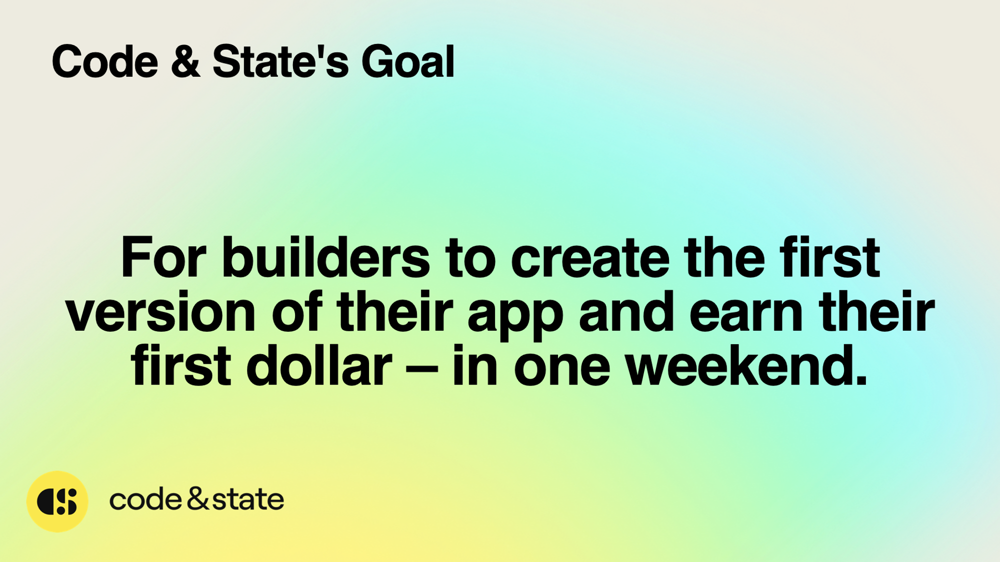

# Day 7

# Day 7

Welcome to the last day of the week 👋

Once again, congratulations on making it this far!

Today is a special day, and thus this guide will be slightly different than usual. This Bootcamp is meant to be your first step into the **Internet Computer ecosystem**. This ecosystem is very new, and tons of opportunities are available. Each journey is different, and it’s up to you to find the best path depending on what you like. But today let me guide you some directions and tips, based on my own experience.

## Make Sure to Graduate 🎓

First things first!

**Even if you have not completed all the requirements, MAKE SURE TO FILL OUT [THE GRADUATION FORM](https://forms.gle/8kHddDJhAUWdQ6S68).**

As I’ve already mentionned, I’m actively building on-chain infrastructure for credentials and diplomas for this Bootcamp. It might take several months before you actually receive your NFT diploma, but you will(I swear!).

I’m also working to make the diploma as cool and useful as possible on the IC. For instance, there is a special portal on DSCVR, that can only be unlocked if you have the **Motoko Bootcamp diploma**. I’ll be adding some similar functionalities for this one. And more in the future (OpenChat, NFID, Distrikt…) 

## Check our Initiatives ✨

At Code & State, we are focused on making the lives of entrepreneurs and builders like you easier. That’s why we are working on several initiatives that you might find useful. Oh, and we are still a very young and small team. We are actively looking for top talents with good ideas and a desire to become brilliant entrepreneurs. If that sounds like you, make sure to reach out.

### ICP Community Conference 🥳

The **ICP Community Conference** is the 1st organized conference that celebrates, inspires, & connects the [#InternetComputer](https://twitter.com/search?q=%23InternetComputer&src=hashtag_click) ecosystem. The first edition was held in May 2023, in the famous [Miami Hard Rock Hotel](https://www.google.com/search?q=miami+hard+rock+hotel&sca_esv=559959589&ei=i6PoZNC-HYOJkdUPuOuGiAc&hotel_occupancy=2&oq=Miami+hard&gs_lp=Egxnd3Mtd2l6LXNlcnAiCk1pYW1pIGhhcmQqAggAMggQABiKBRiRAjIFEAAYgAQyCBAAGIoFGJECMgUQABiABDIFEAAYgAQyBRAAGIAEMgUQABiABDIFEAAYgAQyDhAuGIoFGMcBGK8BGJECMgcQLhiABBgKSN1jUN8CWLNdcAJ4AZABAJgBsAGgAfoMqgEEMC4xMrgBA8gBAPgBAagCAMICChAAGEcY1gQYsAPCAhEQLhiABBjHARivARiYBRiZBcICDRAuGIoFGMcBGNEDGEPCAgcQABiABBgKwgIHEAAYigUYQ8ICIBAuGIAEGMcBGK8BGJgFGJkFGJcFGNwEGN4EGOAE2AEBwgITEC4YigUYxwEYrwEYmAUYmQUYQ8ICFhAuGIoFGMcBGK8BGJgFGJ4FGJkFGEPCAgcQLhiKBRhDwgINEC4YigUYxwEYrwEYQ8ICCBAuGIoFGJECwgIKEC4YgAQY1AIYCsICBRAuGIAE4gMEGAAgQYgGAZAGCLoGBggBEAEYFA&sclient=gws-wiz-serp) and gathered more than 100 community members. It’s organized by Code & State. I was there and it was an incredible moment. You get to meet all the community members, builders, developers, and founders in the ecosystem. The connections and memories I’ve made are priceless. There's no way I'm missing the next one (and we are working on some special guests, that will move the conference to the next level)!

Here are some follow-up items for you:

- [ ]  Check out the [ICP Conference Talks Playlist.](https://www.youtube.com/playlist?list=PLeNYxb7vPrkipUy68zln3pEOwowsehCbR) It contains all the talks from the conference.
- [ ]  Follow [ICP CC](https://twitter.com/icp_cc) on Twitter.
- [ ]  [Join our email list](https://webforms.pipedrive.com/f/6N8jTemXLwtr7dhqUokx3X1BIwMQFD6jpror1KBZNhTOOaly1bFhWhASOYXRT9QotZ)! Grab your tickets early for a discount. Considering how fast they might sell out, you'll want to be in the know

### TalentDB

Since the technology is so new and pretty specific, it’s very hard for project building on the Internet Computer to find the correct talents. That’s why we’ve created TalentDB, which is the first ICP-focused recruiting agency.

TalentDB offers ICP projects access to the talent they desperately need, and when a role is filled we collect a competitively priced recruitment fee. The revenue from these recruiting fees keeps both TalentDB and Motoko Bootcamp running and available as resources for onboarding new developers into the ICP ecosystem. TalentDB is led [by Ben.](https://twitter.com/MrBennyP)

Here are some follow-up items for you:

- [ ]  Fill out [this form](https://airtable.com/shrwzsX9FhZ5X0wlv) to request to join the talent pool.
- [ ]  Follow [TalentDB on Twitter.](https://twitter.com/talentdb_icp)
- [ ]  Book a meeting with Ben, if you’d like to discuss further and explore job opportunities. You can connect with him over Twitter or on Discord (#MrBennyP).

### SolidState

Making canisters safe and secure. To make the ICP ecosystem successful, that’s a huge component. As you’ve seen during the Security workshop, Internet Computer applications have very specific security concerns. To solve the lack of expertise and commitment to realize an audit in the ecosystem, we’ve started SolidState. We are currently auditing some of the top DeFi projects on the Internet Computer, notably [Sonic.](https://lbp.sonic.ooo/) In the next few months, we are looking to expand our team and expertise.

Here are some follow-up items for you:

- [ ]  If you’re interested in becoming a Rust or Motoko auditor, make sure to contact [Isaac.](https://twitter.com/isaac_icp)
- [ ]  If you have an ICP project that you’d like to audit. You can fill out [this form a](https://webforms.pipedrive.com/f/6FrBpbJSLLqnykpYHOQgSNXez75N14dxqiqiSHXtEFRpW3bwFGSBIRI1Kw61N4L81J)nd we will get in touch.

### Education
And the best for the end. My favorite section. In case you didn’t know, I’m leading everything related to Education at Code & State.

We have already organized several **Motoko Bootcamps**, and this was our first **TypeScript Bootcamp** but we are just getting started. I’m on an adventure to build the best school for the Internet Computer and Web3, I want more people to change their lives and improve the world doing so. So if you want to join me on this adventure here are some follow-up items for you:

- [ ]  Follow [Motoko School](https://twitter.com/MotokoSchool) on Twitter.
- [ ]  Make sure that you are both in the [Code & State](https://discord.gg/fxGWecsP) and [Motoko Bootcamp](https://www.notion.so/Day-7-03b6f6a95a89451a8a55d02e37ebf97b?pvs=21) Discord.
- [ ]  If you’d like to have a chat with me, to discuss and brainstorm ideas. [Feel free to book a meeting](https://calendly.com/sebastien-thuillier/), I love meeting builders.

## Build👷

There is so much to build on this ecosystem. It’s like the Golden Rush but for builders. Here are some of the programs to check.

### Bounties

Bounties are relatively small projects or libraries that need to be built for the ecosystem. DFINITY in collaboration with community members, has developed a bounty program. Essentially you build something with instructions, and you get rewarded if you complete the work and submit a valid project. The bounties are very diverse. They are currently mainly in Motoko and Rust, but they’ll probably incorporate TypeScript in the future.

- [DFINITY Bounties](https://forum.dfinity.org/c/developers/bounties/37)
- [IC Devs Bounties](https://icdevs.org/bounties.html)

### Grant program

The developer grant program provides support to developers building on the Internet Computer. Essentially, if you have an idea and want to build on the IC, you make a request and can receive $5000, $25K, or even $100K in funding (though $100K is extremely unlikely for first-time applications). The grant program is currently focused on the following areas:

- Canister Development Kits (CDKs) & Agents
- Developer Tooling (e.g. IDEs, debuggers, logging libraries)
- Infrastructure (e.g. oracles, asset bridges)
- Integrations & APIs (e.g. chat, email, maps)
- Apps & Open Internet Services

DFINITY, also recently announced a specific **[$5 million** program to bridge the gap between AI and blockchain technology.](https://www.prnewswire.com/news-releases/dfinity-foundation-launches-5-million-grant-to-support-decentralized-ai-on-the-internet-computer-blockchain-301877065.html)

### Request for startup

Here is an interesting document that compiles [ideas for startups to build on the IC](https://github.com/dfinity/grant-rfps/blob/main/requests-for-startups.md). Pretty cool.

### Code & State

Here is what we, at Code & State, want to achieve. To help us in our mission, we are looking for entrepreneurs and builders.

Who exactly? 

We're looking for people with **a strong entrepreneurial mindset** interested in building tools and frameworks that other developers can use. If you're working on a specific project like an NFT collection or a game, it's probably not a match for us. However, if you find that you've created reusable tools in the process (frameworks or libraries), we'd like to hear from you. We're also open to trying out unconventional ideas, so feel free to reach out.

## Feedback 
Thanks for participating inthis week. I hope you enjoyed it. If you can, [please leave some feedback on the Discord channel.](https://discord.gg/QNxMVyPmse) Whether it's positive or negative, it's all useful. We want to improve the experience for future students, so let us know what you liked and what could be better.