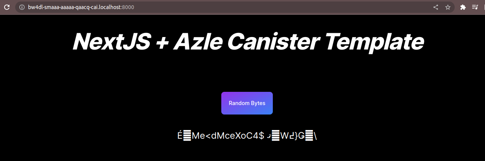

# IC Dapp Template

## Prerequisites

- dfx > 0.15.0-ext.0
- Nodejs >= 18.16.0
- yarn
- jq (Command line based JSON processor).
- To install jq run:

    `sudo apt update && sudo apt install -y jq`

Follwing are the steps to deploy your application locally

1. Install dependencies:

    `yarn && cd azle/ && yarn && cd ..`

2. Run below commands:

   ```dfx start --clean --background```

   `bash scripts/deploy_frontend_canister.sh  local`

- To Stop Replica run:

   ```dfx stop```

   
